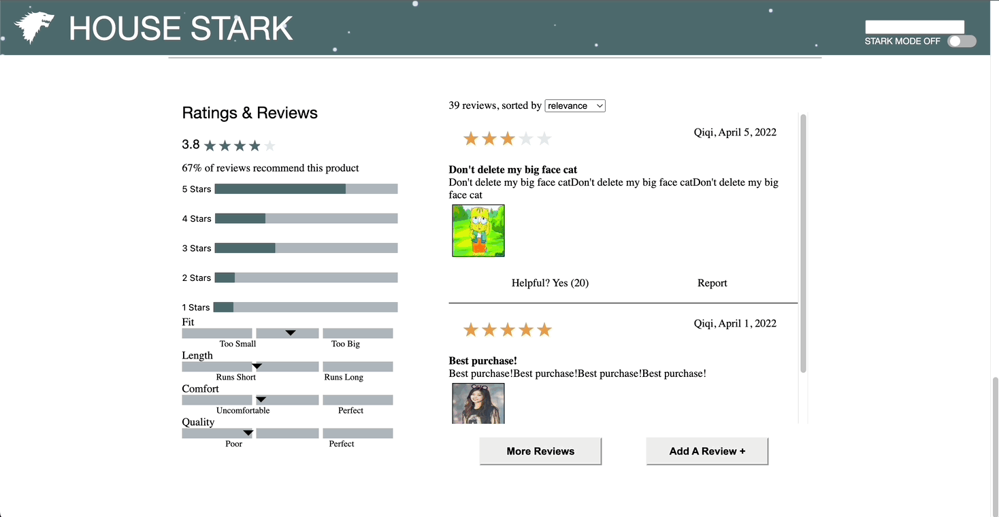

<div id="top"/>

# Atelier E-Commerce

Atelier E-Commerce is a product page for an e-commerce website. Users can browse product pictures and styles in the product overview, view and compare related products, interact with product questions and answers, and view, filter, and post reviews. This is the culmination of four engineers collaborating over the course of two weeks to build a webpage from a wireframe and specification document.

## Table of Contents

1. [Tech Stack](#tech-stack)
1. [Product Features](#product-features)
    - [Product Overview](#product-overview)
    - [Related Products](#related-products)
    - [Questions & Answers](#questions--answers)
    - [Reviews](#reviews)
    - [Stark Mode](#stark-mode)
1. [Gettings Started](#getting-started)
    - [Installation](#installation)
1. [Contributors](#contributors)

## Tech Stack


## Product Features

### Product Overview
>Users can browse product pictures, select different styles, add in-stock items to their carts, and share products on social media.


### Related Products
>Users can browse related products in an image carousel, select a related product to be displayed in the overview, and click the star to view a comparison of product features. Users can also click on _Add to Outfit_ to add the currently displayed product to their personal outfit list.


### Questions & Answers
>In this section, users can search, view, post, and interact with the product questions and answers.
In the search bar, users can type in keywords to filter the question list. Users can mark questions as helpful or report them to provide feedback. Users can also add a question or an answer to an existing question.
To improve the UX, the Q&A section by default shows no more than 2 questions and 2 answers, but users can expand and collapse a full view of the Questions and Answers lists.


### Reviews
>Users can sort reviews by helpfulness, date added, and relevance. Users can also add their own custom review. The breakdown section shows multiple graphs representing the ratings for the product. Review list is expandable to show more reviews if wanted.



### Stark Mode
>Instead of dark mode, we created _Stark Mode_. It was an opportunity to break from the clean, minimalist design and have a little fun with CSS.


## Getting Started

### Installation
From the root directory, run the following commands in your terminal:

#### 1. Install all dependencies

```
  npm install
```
or
```
  yarn install
```

#### 2. Start the development server.

```
  npm run server-dev
```
or
```
  yarn server-dev
```
Open http://localhost:1128 to view it in your browser

#### 3. Build for production

```
  npm run react-dev
```
or
```
  yarn react-dev
```

## Contributors

&nbsp;

<a href="https://github.com/FEC-House-Stark/rfc2209-front-end-capstone-HouseStark/graphs/contributors">
  
</a>

&nbsp;
||||
| ------------- | ------------- | ------------- |
| Product Overview  | [Jojo Ortiz](https://github.com/jojortz)  |  [](https://linkedin.com/in/joseromanortiz)|
| Related  | [Ricardo Vargas](https://github.com/RichiV24) | [](https://www.linkedin.com/in/ricardo-vargas24/)|
| Questions & Answers  |[Georgina Lin](https://github.com/xialin0702) | [](https://www.linkedin.com/in/georginalin/)|
| Reviews | [Justin Turkaly](https://github.com/JustinTurkaly) | [](https://www.linkedin.com/in/justinturkaly/)|

<p align="right"><a href="#top">Back to top &#8593;</a></p>